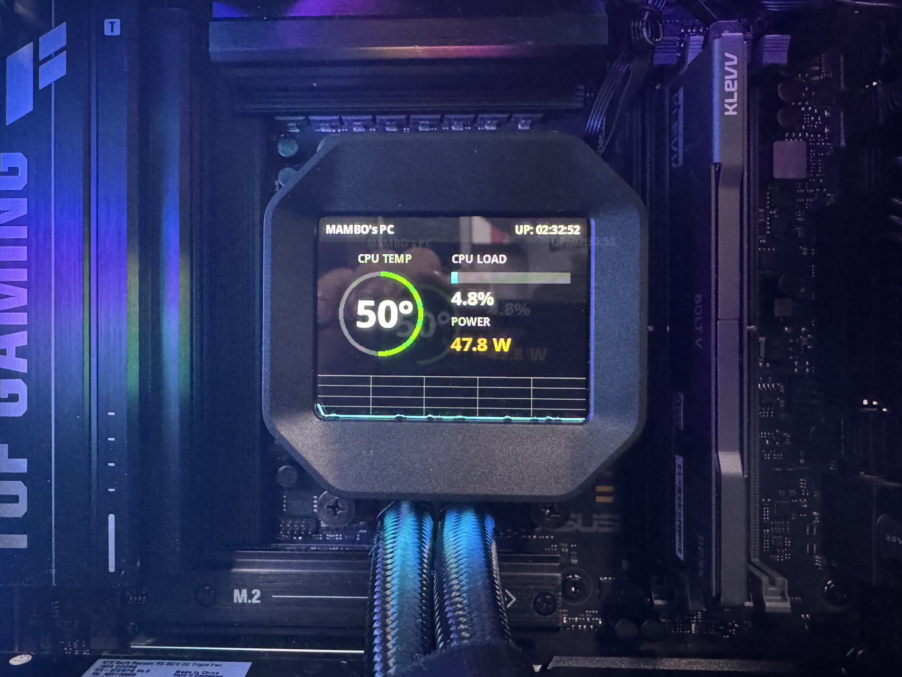

7. # Deepcool 冰域系列 (Liquid Cooler) Linux Python 驱动

   

   

   ## *1. 简介*

   

   这是一个为 Deepcool（九州风神）冰域系列水冷（如 Mystique 240/360）编写的 Linux 驱动程序。

   由于 Deepcool 官方并未提供 Linux 下的数显控制软件，本项目通过逆向工程分析了 USB 通信协议，使用 Python 实现了在该水冷屏幕上显示**系统监控信息**（CPU 温度/功耗/占用/运行时间）以及**多媒体内容**（图片/GIF/视频）。

   **重大更新 (v2.0)：** 本项目现已重构为 **Client/Server (C/S) 架构**。后台作为一个 Systemd 服务运行，负责驱动屏幕和渲染；前台提供命令行工具（CLI），允许用户在任何终端随时发送指令切换显示内容或调节亮度，无需每次都重启程序。

   

   ## *2. 功能特性*

   

   

   ### 🖥️ 系统监控 (Monitor Mode)

   

   - **实时数据**：显示 CPU 温度、负载百分比、实时功耗 (基于 Intel RAPL 或 AMD 传感器)。
   - **精确计时**：系统运行时间 (Uptime) 精确到秒。
   - **历史曲线**：底部绘制 CPU 占用率的历史波形图，并配有参考网格线。
   - **动态 UI**：根据温度改变颜色（绿 -> 黄 -> 红），UI 元素像素级对齐，美观整洁。

   

   ### 🎬 多媒体播放 (Media Mode)

   

   - **全格式支持**：得益于 OpenCV，支持播放 **MP4, AVI, MKV, GIF** 等多种视频格式，以及 **JPG, PNG** 等静态图片。
   - **智能渲染**：
     - **视频/GIF**：自动同步帧率，循环播放。
     - **静态图**：自动识别单帧内容，进入低功耗模式（只渲染一次，不占用 CPU）。
   - **自适应缩放**：内置 "Letterboxing" 算法，自动保持原始画面比例并居中，黑边填充，拒绝拉伸变形。

   

   ### 🎛️ 交互控制

   

   - **亮度调节**：支持通过命令行软件调节屏幕亮度 (0-100%)。
   - **无缝切换**：通过 Socket 通信，可在监控模式和媒体模式间秒切。

   

   ## *3. 安装与配置*

   

   本项目推荐作为 **Systemd 系统服务** 运行。

   

   ### 3.1 安装依赖

   

   需要安装 Python 以及 `pyusb`, `psutil`, `pillow`, `opencv`。

   **Arch Linux:**

   Bash

   ```
   sudo pacman -S python-pyusb python-psutil python-pillow python-opencv
   ```

   **Ubuntu/Debian (可能需要创建 venv):**

   Bash

   ```
   sudo apt install python3-opencv python3-pillow python3-psutil python3-usb
   ```

   

   ### 3.2 部署脚本

   

   假设我们将项目放在 `/opt/deepcool` 目录下：

   Bash

   ```
   sudo mkdir -p /opt/deepcool
   sudo cp main.py /opt/deepcool/
   ```

   

   ### 3.3 配置后台服务 (Systemd)

   

   创建服务文件：`sudo nano /etc/systemd/system/deepcool_screen.service`

   写入以下内容（注意检查 python 路径）：

   Ini, TOML

   ```
   [Unit]
   Description=DeepCool LCD Screen Driver
   After=network.target
   
   [Service]
   Type=simple
   User=root
   # 如果你使用 venv，请将 /usr/bin/python 替换为 venv 中的 python 路径
   ExecStart=/usr/bin/python /opt/deepcool/main.py --daemon
   Restart=on-failure
   RestartSec=5
   
   [Install]
   WantedBy=multi-user.target
   ```

   启动并设置开机自启：

   Bash

   ```
   sudo systemctl daemon-reload
   sudo systemctl enable --now deepcool_screen.service
   ```

   

   ### 3.4 配置命令行工具 (CLI)

   

   创建一个方便的命令 `deepcool`，让你在任何地方都能控制屏幕。

   创建文件：`sudo nano /usr/local/bin/deepcool` 写入：

   Bash

   ```
   #!/bin/bash
   # 请确保这里的 python 路径与服务中一致
   /usr/bin/python /opt/deepcool/main.py "$@"
   ```

   赋予执行权限：

   Bash

   ```
   sudo chmod +x /usr/local/bin/deepcool
   ```

   

   ## *4. 使用说明*

   

   现在你可以直接在终端使用 `deepcool` 命令了（无需 sudo）：

   - **切换到监控模式**：

     Bash

     ```
     deepcool --monitor
     ```

   - **播放多媒体 (图片/GIF/视频)**： 使用 `--media` 参数，脚本会自动识别文件类型。

     Bash

     ```
     # 显示图片
     deepcool --media /path/to/image.jpg
     
     # 播放 GIF
     deepcool --media /path/to/animation.gif
     
     # 播放视频 (Bad Apple!!)
     deepcool --media /path/to/video.mp4
     ```

   - **调节亮度**： 范围 0 - 100。

     Bash

     ```
     deepcool --brightness 50
     ```

   

   ## *5. 技术细节 (逆向笔记)*

   

   - **通信协议**：通过 Wireshark 抓包分析，设备使用 USB Bulk 传输。
   - **屏幕参数**：分辨率 320x240，色彩格式 RGB565。
   - **帧结构**：
     - 初始化指令：`aa04000603640027b9` / `aa0100092991`
     - 帧头：`aa08000001005802002c01bc11`
     - Payload：153600 字节的纯像素数据。
   - **架构实现**：
     - **Server**：以 root 权限运行，独占 USB 设备，监听 `/tmp/deepcool.sock`。
     - **Client**：向 Socket 发送 JSON 指令，Server 接收后更新内部状态机。

   

   ## *6. 已知问题*

   

   - **平台限制**：功耗读取依赖 Linux 的 `/sys/class/powercap` (Intel RAPL) 或 `/sys/class/hwmon` (AMD)，在某些虚拟机或特殊主板上可能无法读取到功率。
   - **硬件兼容性**：目前仅在 Deepcool 冰域 (Mystique) 系列上测试通过，其他型号（如数显版 AK 系列风冷）协议可能不同。

   

   ## *7. 附图*




